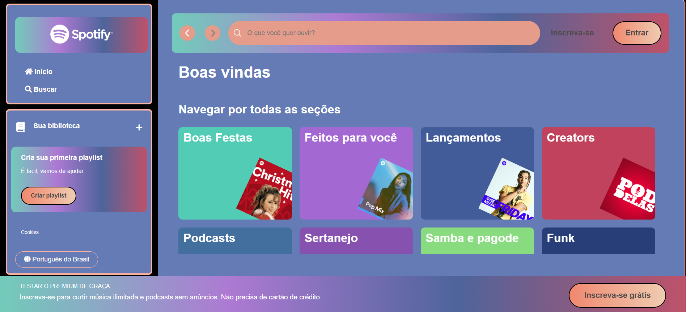
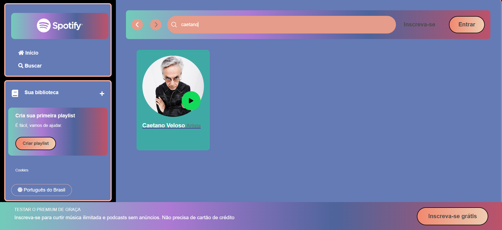

# 🎵🎶 Spotify Clone

Uma réplica da interface do Spotify desenvolvida com HTML, CSS e JavaScript, utilizando uma API local para exibição de artistas e álbuns. Esse projeto foi desenvolvido durante a imersão front-end 2025, promovido pela Alura.

## 🚀 Tecnologias Utilizadas

- HTML5 
- CSS3
- JavaScript (Vanilla JS)
- [JSON Server](https://github.com/typicode/json-server) (para simular uma API local)
- [Live Server](https://marketplace.visualstudio.com/items?itemName=ritwickdey.LiveServer) (para facilitar a execução do projeto no navegador)
- [Git](https://git-scm.com/) (para controle de versão)
- [Node.js](https://nodejs.org/) (para gerenciar dependências e rodar scripts)

## 📂 Estrutura do Projeto

```
📂 spotify-imersao
│── 📂 api-artists      # Arquivo JSON com os dados dos artistas
│   │── artists.json
│
│── 📂 assets          # Imagens e recursos do projeto
│   │── 📂 demosntracao
│   │── 📂 icons
|   |── 📂 playlist
│
│── 📂 src            
│   │── 📂 styles      # Arquivos de estilo (CSS)
│   │   │── main-content.css
│   │   │── media-queries.css
│   │   │── reset.css
│   │   │── sidebar-footer.css
│   │   │── vars.css
│
│── artists.json       # Dados JSON
│── index.html         # Página principal
│── script.js          # Código JavaScript
│── LICENSE            # Licença do projeto
│── README.md          # Documentação do projeto
```

## 🛠️ Como Rodar o Projeto

Para visualizar e testar esse projeto no seu navegador, siga os passos abaixo:

### 1️⃣ Clonar o Repositório
```sh
git clone https://github.com/AnaLuisaPS07/imersao-front-end.git
cd seu-repositorio
```

### 2️⃣ Instalar o JSON Server
Se ainda não tiver o JSON Server instalado, execute:
```sh
npm install -g json-server
```

### 3️⃣ Iniciar a API Local
No diretório do projeto, execute:
```sh
json-server --watch api-artists/artists.json --port 3000
```
Isso iniciará um servidor local que servirá os dados dos artistas na porta **3000**.

### 4️⃣ Rodar o Projeto no Navegador
Você pode abrir o arquivo `index.html` manualmente, eu recomendo utilizar a extensão [Live Server](https://marketplace.visualstudio.com/items?itemName=ritwickdey.LiveServer) no VS Code para facilitar:

1. Instale a extensão Live Server no VS Code.
2. Abra o projeto no VS Code.
3. Clique com o botão direito no `index.html` e selecione **"Open with Live Server"** ou se preferir clique no botão **"Go live"** no canto direito inferior na tela do Vs Code.
4. O navegador abrirá automaticamente com o projeto rodando.

## 📸 Demonstração






## 📌 Funcionalidades
✅ Interface semelhante ao Spotify  
✅ Listagem dinâmica de artistas consumindo API local  
✅ Responsivo para diferentes dispositivos  

## 🤝 Como Contribuir

Quer contribuir com melhorias para o projeto? Siga os passos abaixo:

1. **Faça um fork** do repositório.
2. **Crie uma branch** para sua feature ou correção:  
   ```sh
   git checkout -b minha-feature
   ```
3. **Realize as alterações** e faça commits claros:  
   ```sh
   git commit -m "Adicionando nova funcionalidade X"
   ```
4. **Envie para o seu fork**:  
   ```sh
   git push origin minha-feature
   ```
5. **Abra um Pull Request** para revisão.

## 📜 Licença
Este projeto é apenas para fins educacionais e não possui vínculo com o Spotify oficial.

---
💡 Desenvolvido por [Ana Luísa](https://github.com/AnaLuisaPS07)